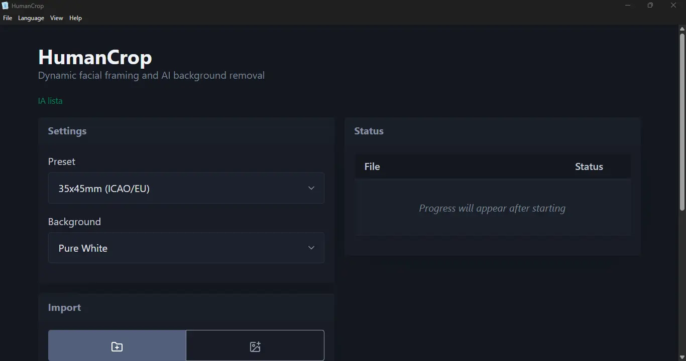
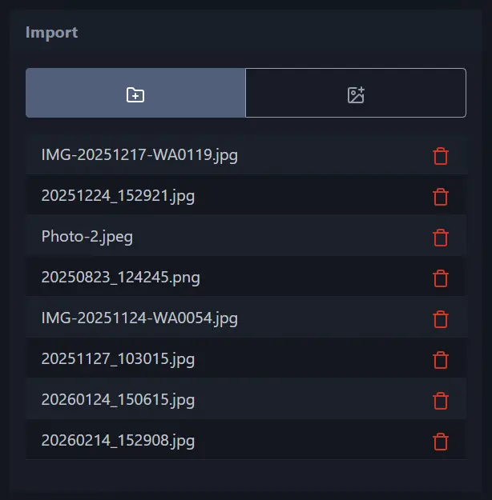
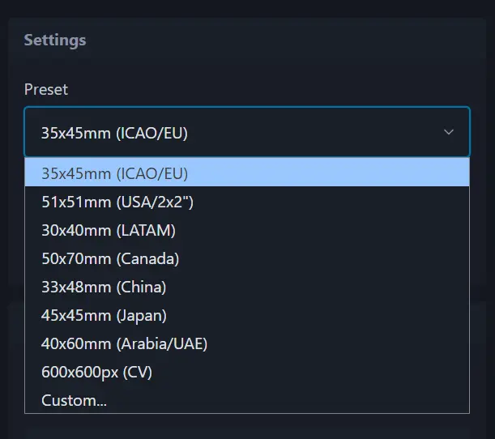
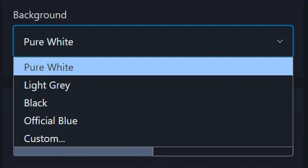
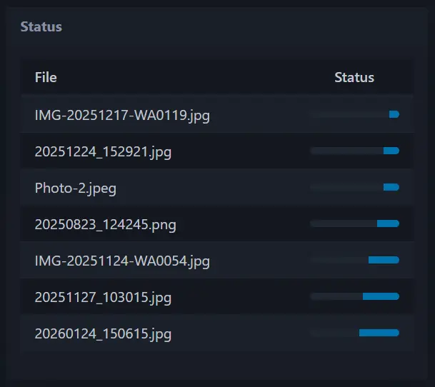
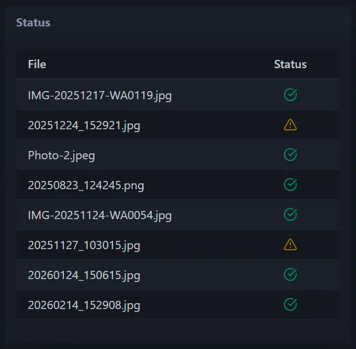
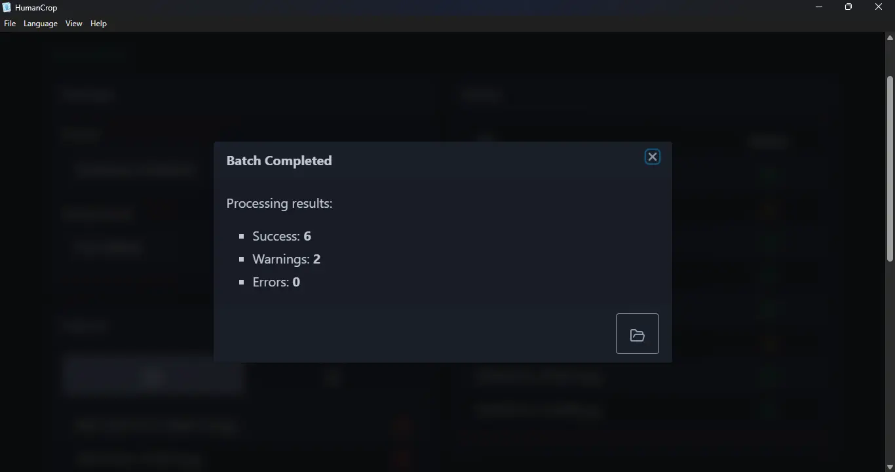
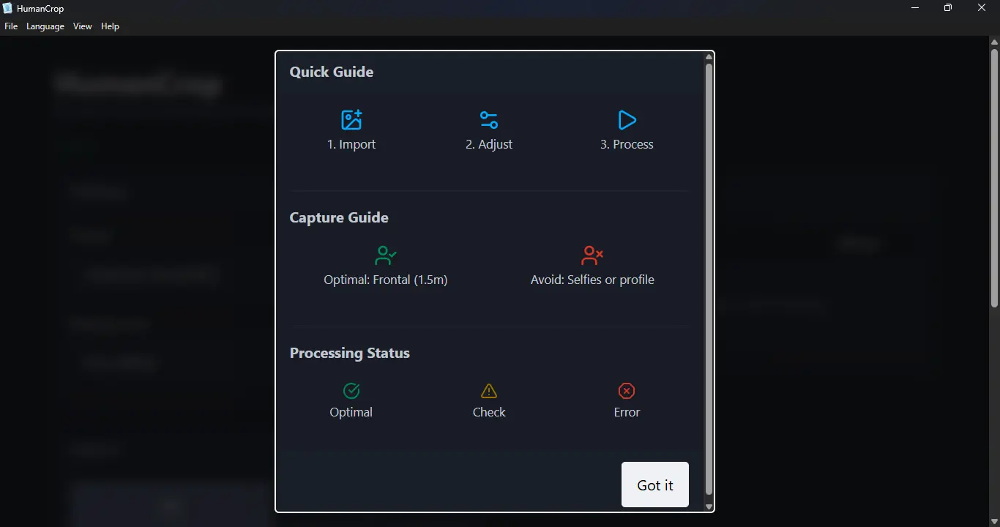

<p align="center">
  
</p>

<h1 align="center">HumanCrop</h1>

<p align="center">
  <a href="https://www.electronjs.org/"></a>
  <a href="https://www.typescriptlang.org/"></a>
  <a href="https://nodejs.org/"></a>
  <a href="LICENSE"></a>
  
</p>

HumanCrop is a high-performance desktop application designed for the automated batch processing of official ID and passport photos. It utilizes local artificial intelligence to perform biometric face detection, background removal, and standard-compliant cropping entirely offline, ensuring maximum data privacy and system efficiency.

## Features

- **Offline AI Processing**: Execute high-precision tasks locally using **@vladmandic/human** and **@imgly/background-removal-node**, ensuring no data leaves the device.
- **Biometric Cropping**: Intelligent face detection and standardized cropping powered by the **Human** library (BlazeFace) to meet international ICAO requirements.
- **Background Removal**: State-of-the-art subject extraction using the **IMG.LY** engine (RMBG-1.4), optimized for offline execution.
- **Batch Processing**: Simultaneous handling of multiple images or entire directories using a multi-threaded architecture.
- **Privacy First**: All image data is processed locally on the user's hardware; no data is uploaded to external servers.
- **Dynamic Resource Management**: Advanced WorkerPool implementation with process hibernation and memory cleanup to optimize system performance.
- **Multilingual Support**: Fully localized interface available in English and Spanish.
- **Atomic File Operations**: Prevents file corruption through temporary staging and atomic renaming protocols.

## Prerequisites

- **Operating System**: Windows 10/11 (64-bit).
- **Runtime**: Node.js 18.0.0 or higher.
- **Hardware**: 
  - Minimum 4GB RAM (8GB recommended for high-concurrency processing).
  - CPU with SIMD/AVX2 support for optimal AI inference speed.

## Installation

1. Clone the repository to your local machine.
2. Navigate to the project directory and install dependencies:
   ```powershell
   npm install
   ```
3. Compile the TypeScript source code:
   ```powershell
   npm run build
   ```

## Usage

### Development Mode
To launch the application in a development environment:
```powershell
npm start
```

### Production Build
To generate a production-ready installer (NSIS):
```powershell
npm run dist
```

### Application Workflow
1. Select the source directory or individual images for processing.
2. Choose a destination folder for the output files.
3. Select an ID/Passport preset (e.g., Passport EU, US Visa).
4. Configure the desired background color.
5. Click **Start Batch** to begin processing.

## Structure

HumanCrop is organized into a modular architecture to separate the UI, processing logic, and background execution:

```
humancrop/
├── build/                # Build resources and icons
│   ├── icon.ico          # Windows application icon
│   └── icon.icns         # macOS application icon
├── docs/                 # Project documentation and assets
│   └── screenshots/      # UI captures and AI result examples
├── scripts/              # Build and automation scripts
│   └── apply-fuses.js    # Security fuses lockdown script
├── src/                  # Source code
│   ├── assets/           # Static assets
│   │   ├── css/          # Local stylesheets (PicoCSS)
│   │   ├── models/       # Offline AI model weights
│   │   └── icon.png      # High-resolution master logo
│   ├── locales/          # Localization (en.json, es.json)
│   ├── main.ts           # Electron main process & WorkerPool
│   ├── processor.ts      # Biometric AI & image processing core
│   ├── worker.ts         # Isolated background worker script
│   ├── renderer.ts       # Renderer process & UI state
│   ├── preload.ts        # Secure contextBridge interface
│   ├── index.html        # Main application layout
│   └── styles.css        # Global UI styling
├── package.json          # Project metadata and dependencies
├── tsconfig.json         # TypeScript configuration
├── LICENSE               # MIT Legal terms
└── README.md             # This documentation
```

### Key Modules
- **Main Process (`main.ts`)**: Manages the application lifecycle and coordinates the `WorkerPool`.
- **Image Processor (`processor.ts`)**: The core engine that handles AI inference, background removal, and cropping.
- **Worker Pool**: A multi-threaded system that distributes image tasks across multiple isolated Node.js processes.
- **Renderer (`renderer.ts`)**: Manages the reactive UI and communicates with the main process via IPC.

## AI Results Example

Comparison between the original input and the processed biometric ID photo with background removal and standardized cropping:

<p align="center">
  
  
</p>

## Application Screenshots

A visual overview of the HumanCrop user interface and core application workflow:

### Main Interface and Configuration
<p align="center">
  
</p>

### Import and Preset Selection
<p align="center">
  
  
</p>

### Background Customization and Status
<p align="center">
  
  
</p>

### Batch Processing and Completion
<p align="center">
  
  
</p>

### User Guide
<p align="center">
  
</p>

## License

This project is licensed under the [MIT License](LICENSE).
