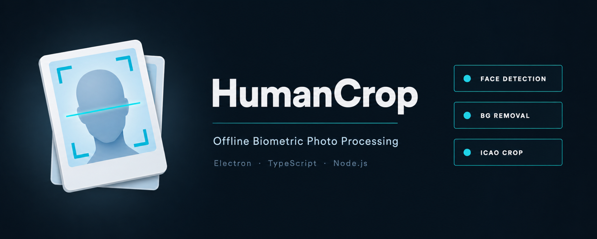
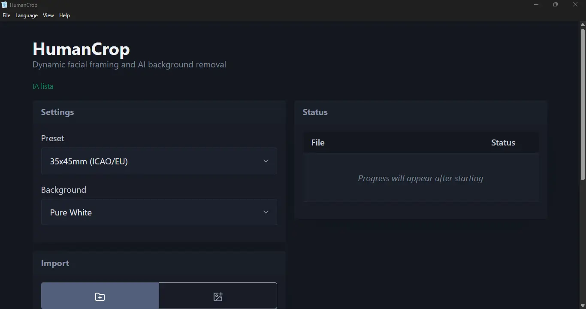
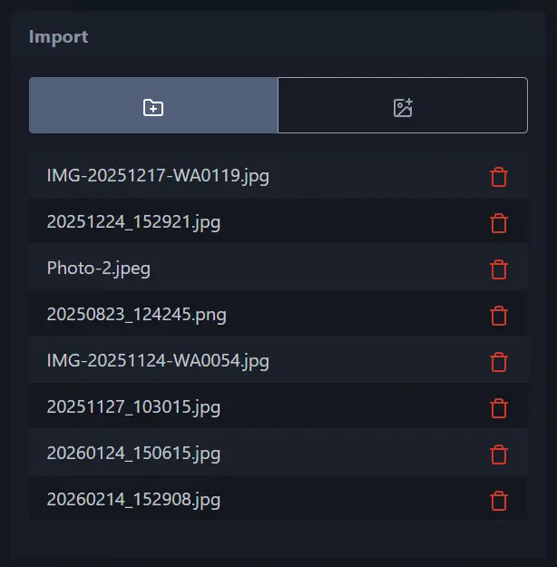
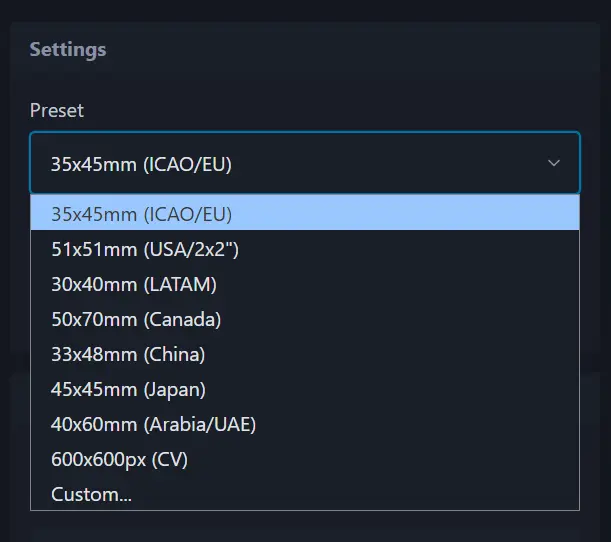
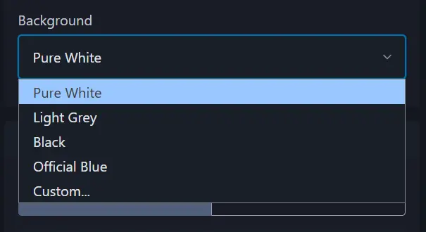
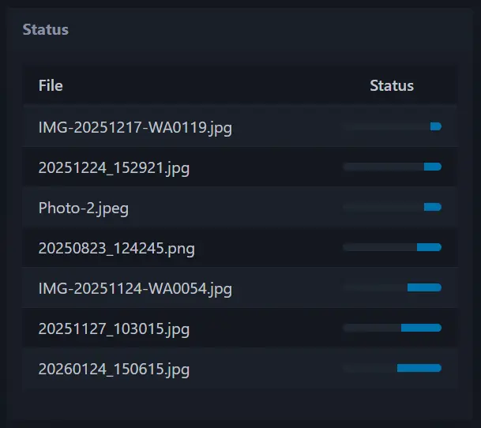
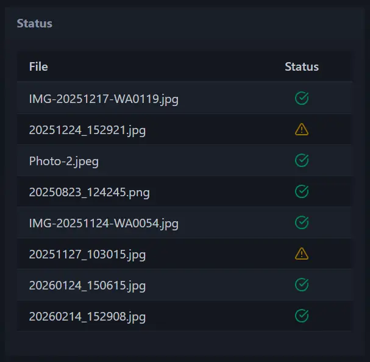
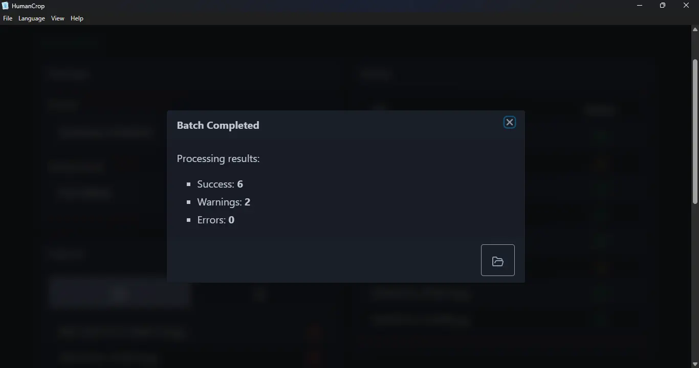
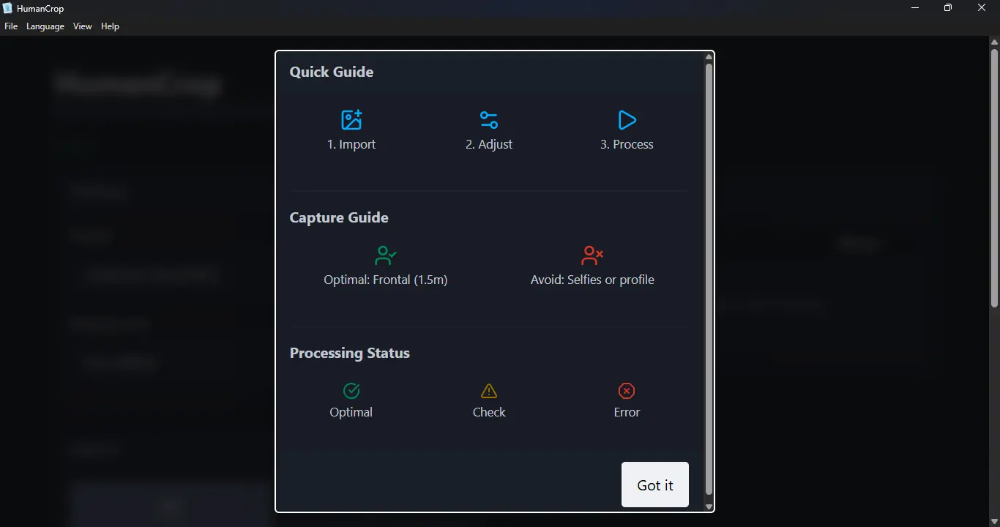

<p align="center">
  
</p>

<h1 align="center">HumanCrop</h1>

<p align="center">
  <a href="https://nodejs.org/">
    
  </a>
  <a href="https://www.typescriptlang.org/">
    
  </a>
  <a href="https://www.electronjs.org/">
    
  </a>
  <a href="https://www.tensorflow.org/js">
    
  </a>
  <a href="LICENSE">
    
  </a>
</p>

<p align="center">
  High-performance, privacy-first desktop application for offline batch processing of official ID photos using AI biometric cropping and background removal.
</p>

---

## Quick Start

```bash
git clone https://github.com/roymejia2217/HumanCrop.git
cd HumanCrop
npm install
npm run build
```

```bash
npm start
```

---

## Features

| Feature | Description |
|---------|-------------|
| **Image and folder import** | Selects individual JPG, JPEG, PNG, and WebP files or a complete source directory from the desktop interface. |
| **Biometric presets** | Produces predefined output sizes for EU, US, LATAM, Canada, China, Japan, Arabia/UAE, and CV photo formats. |
| **Custom dimensions** | Converts custom millimeter dimensions to 300 DPI pixel output with size validation. |
| **Offline face detection** | Detects faces locally with the bundled Human BlazeFace model through TensorFlow.js WASM. |
| **Offline background removal** | Runs bundled background model chunks through ONNX Runtime CPU inference without uploading images. |
| **Background color control** | Applies white, gray, black, blue, or custom background colors to generated photos. |
| **Batch worker pool** | Processes images through isolated worker processes with concurrency derived from CPU cores and available memory. |
| **Progress reporting** | Streams per-file processing, success, warning, and error states into the renderer progress table. |
| **Localized interface** | Loads English and Spanish translations through i18next and exposes a language menu. |
| **Secure desktop bridge** | Uses Electron context isolation and a preload bridge for filesystem dialogs, IPC events, and result folder opening. |
| **Atomic output writes** | Writes each processed PNG to a temporary file before renaming it into the destination folder. |
| **Release validation** | Validates model hydration, packaging targets, native module unpacking, and runtime constraints before release builds. |

---

## Prerequisites

| Dependency | Purpose | Installation |
|------------|---------|--------------|
| **Node.js** >=22.12.0 | Runs the Electron build tooling and application scripts. | [Download Node.js](https://nodejs.org/) |
| **npm** >=10.0.0 | Installs dependencies and runs project scripts. | Bundled with Node.js |
| **Git LFS** | Hydrates the bundled AI model assets before packaging. | `git lfs install && git lfs pull` |
| **Linux desktop libraries** | Satisfy Debian package runtime dependencies for Electron desktop integration. | `sudo apt install libgtk-3-0 libnotify4 libnss3 libxss1 libxtst6 xdg-utils libatspi2.0-0 libuuid1 libsecret-1-0` |

**Note:** Release packaging validates hydrated model assets before building installers. If model files are still Git LFS pointers, `npm run validate:models` and release builds fail intentionally.

---

## Installation

```bash
npm install
npm run build
npm run validate:models
```

---

## Usage

### Desktop App

```bash
npm start
```

1. Choose a source folder or add individual image files.
2. Select an output folder.
3. Choose a biometric preset or enter custom dimensions.
4. Choose a background color.
5. Start the batch and review the per-file status table.
6. Open the result folder from the completion dialog.

### Development Build

```bash
npm run dev
```

1. Compile the TypeScript source.
2. Launch Electron from the compiled `dist` entrypoint.

### Release Build

```bash
npm run dist
```

1. Validate model assets.
2. Compile the TypeScript source.
3. Package the application with Electron Builder.

**Output naming:**
- Processed images are written as PNG files named `{original_name}_{preset}.png`.
- Temporary output files are staged in the selected destination folder and atomically renamed after the write succeeds.

**Status meanings:**
- Success means the crop fit the selected biometric framing.
- Warning means the output was generated but should be reviewed for tight margins.
- Error means the file could not be processed and the UI shows the mapped error state.

---

## Project Structure

```
HumanCrop/
├── .github/
│   └── workflows/
│       ├── ci.yml
│       └── release.yml
├── build/
│   ├── icon.icns
│   ├── icon.ico
│   └── icons/
├── docs/
│   ├── banner.webp
│   ├── examples/
│   └── screenshots/
├── scripts/
│   ├── apply-fuses.js              # Applies Electron security fuses after packaging.
│   ├── validate-model-assets.js    # Rejects builds with unhydrated Git LFS model pointers.
│   └── validate-release-config.js  # Validates release scripts, packaging settings, and runtime constraints.
├── src/
│   ├── assets/
│   │   ├── icon.png
│   │   └── models/
│   │       ├── human/
│   │       └── imgly/
│   ├── locales/
│   │   ├── en.json
│   │   └── es.json
│   ├── global.d.ts
│   ├── index.html
│   ├── main.ts
│   ├── preload.ts
│   ├── processor.ts
│   ├── renderer.ts
│   ├── styles.css
│   └── worker.ts
├── LICENSE
├── package-lock.json
├── package.json
├── README.md
└── tsconfig.json
```

---

## Building Executables

```bash
npm run dist:win
npm run dist:linux
npm run dist:all
```

Release builds run model validation, compile TypeScript, and write packaged artifacts to `release/`. The Windows target is NSIS, and the Linux targets are AppImage and Debian packages.

---

## Testing

```bash
npm test
npm run build
```

Test coverage includes:
- `scripts/validate-release-config.js`: validates package scripts, model validation policy, lockfile policy, renderer state ownership, and offline background removal runtime constraints.
- `npm run build`: validates TypeScript compilation for the Electron main process, preload bridge, renderer, processor, and worker.

---

## Credits

| Project | Description | License |
|---------|-------------|---------|
| [Human](https://vladmandic.github.io/human/demo/index.html) | Provides local face detection through the bundled BlazeFace model. | MIT |
| [ONNX Runtime](https://github.com/Microsoft/onnxruntime.git) | Runs CPU-only background removal inference from bundled model assets. | MIT |
| [Sharp](https://sharp.pixelplumbing.com) | Reads, resizes, composites, and writes processed image files. | Apache-2.0 |
| [TensorFlow.js](https://github.com/tensorflow/tfjs.git) | Supplies the WASM backend used by the local Human face detector. | Apache-2.0 |
| [i18next](https://www.i18next.com) | Provides runtime localization for the desktop interface and menu labels. | MIT |
| [i18next FS Backend](https://github.com/i18next/i18next-fs-backend) | Loads localization dictionaries from bundled JSON files. | MIT |
| [Lucide](https://lucide.dev) | Renders the application icon set in the renderer process. | ISC |

---

## Screenshots

| Screenshot | Description |
|---|---|
|  | Main interface for configuring batch photo processing. |
|  | Import controls for adding images or a source folder. |
|  | Preset selection for ID, passport, CV, and custom dimensions. |
|  | Background color controls. |
|  | System status panel during setup. |
|  | Batch progress and result statuses. |
|  | Completion dialog with success, warning, and error counts. |
|  | In-app guide for the HumanCrop workflow. |

---

## License

MIT License. See [LICENSE](LICENSE) for details.
