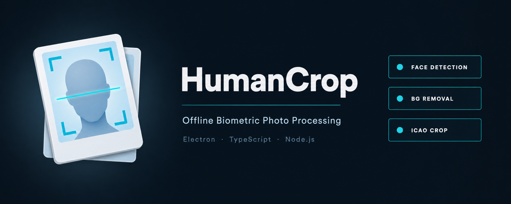
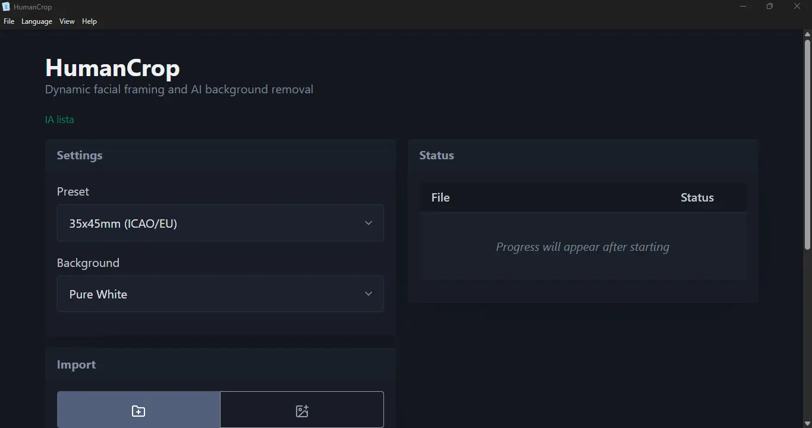
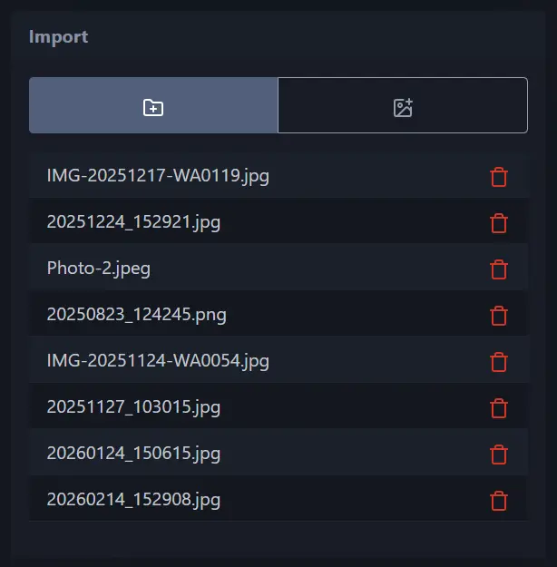
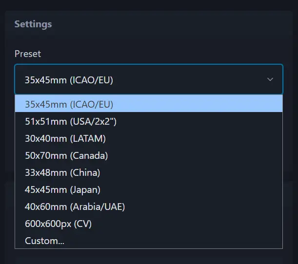
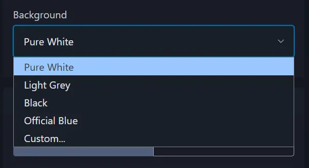
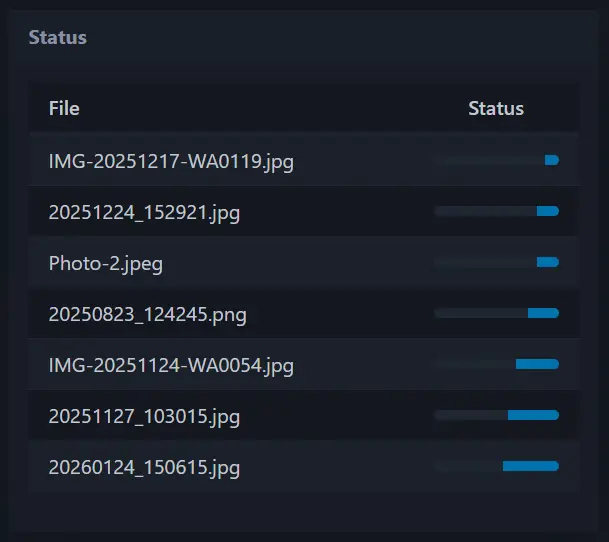
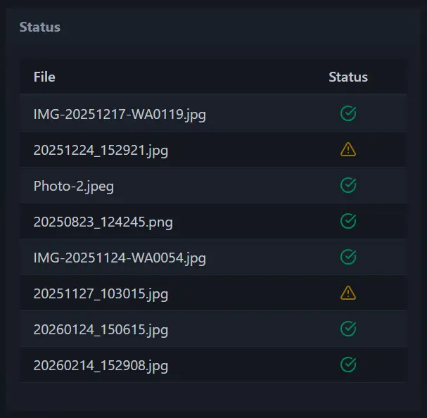
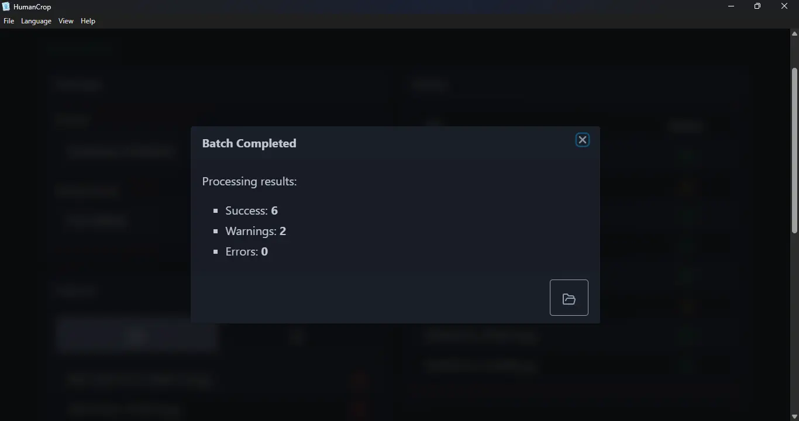
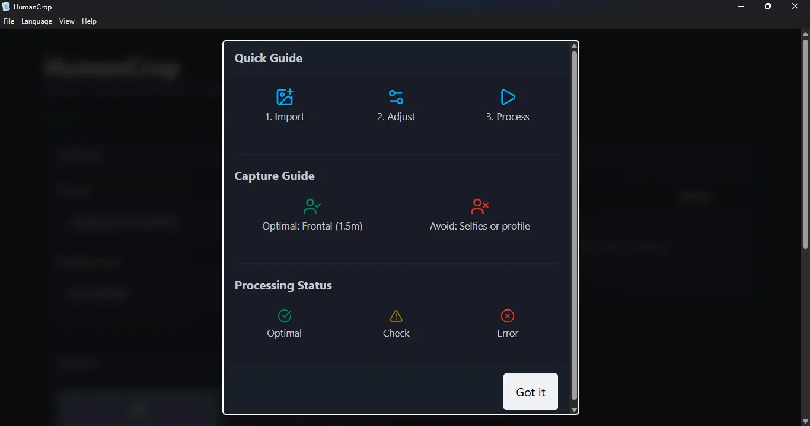

# HumanCrop

<p align="center">
  
</p>

[](https://nodejs.org/)
[](https://www.typescriptlang.org/)
[](https://www.electronjs.org/)
[](https://www.tensorflow.org/js)
[](LICENSE)
[](https://github.com/RichardLitt/standard-readme)

High-performance desktop app designed for the automated batch processing of official ID and passport photos

HumanCrop is a privacy-first Electron application for offline batch processing of official photos. It combines local face detection, background removal, biometric cropping, and deterministic output generation without uploading source images to a remote service.

The npm package identifier is lowercase `humancrop` to follow package naming conventions; the product and repository name remain `HumanCrop`.

## Table of Contents

- [Background](#background)
- [Install](#install)
- [Usage](#usage)
- [Features](#features)
- [Project Structure](#project-structure)
- [Building Executables](#building-executables)
- [Testing](#testing)
- [Examples](#examples)
- [Screenshots](#screenshots)
- [Maintainers](#maintainers)
- [Thanks](#thanks)
- [Contributing](#contributing)
- [License](#license)

## Background

HumanCrop is designed for workflows that need repeatable ID, passport, and CV photo preparation while keeping image processing on the local machine. The application bundles the models required for face detection and background removal, exposes predefined biometric formats, and processes batches through isolated workers.

Release packaging validates model hydration and runtime constraints before producing installers. The Linux AppImage is also checked against the upstream AppImage catalog packaging contract in CI.

## Install

### Dependencies

| Dependency | Purpose | Installation |
| --- | --- | --- |
| **Node.js** >=22.12.0 | Runs the Electron build tooling and application scripts. | [Download Node.js](https://nodejs.org/) |
| **npm** >=10.0.0 | Installs dependencies and runs project scripts. | Bundled with Node.js |
| **Git LFS** | Hydrates the bundled AI model assets before packaging. | `git lfs install && git lfs pull` |
| **Linux desktop libraries** | Satisfy Debian package runtime dependencies for Electron desktop integration. | `sudo apt install libgtk-3-0 libnotify4 libnss3 libxss1 libxtst6 xdg-utils libatspi2.0-0 libuuid1 libsecret-1-0` |

Clone and prepare the project:

```bash
git clone https://github.com/roymejia2217/HumanCrop.git
cd HumanCrop
git lfs pull
npm install
npm run build
npm run validate:models
```

Release packaging fails intentionally when required model assets are still Git LFS pointers.

## Usage

### Desktop App

```bash
npm start
```

1. Choose a source folder or add individual image files.
2. Select an output folder.
3. Choose a biometric preset or enter custom dimensions.
4. Choose a background color.
5. Start the batch and review the per-file status table.
6. Open the result folder from the completion dialog.

### Development Build

```bash
npm run dev
```

This compiles the TypeScript source and launches Electron from the generated `dist` entrypoint.

### Release Build

```bash
npm run dist
```

A release build validates model assets, compiles TypeScript, and packages the configured Electron targets.

Processed images are written as PNG files named `{original_name}_{preset}.png`. Temporary files are staged in the selected destination folder and atomically renamed after a successful write.

Status meanings:

- **Success** means the crop fit the selected biometric framing.
- **Warning** means the output was generated but should be reviewed for tight margins.
- **Error** means the file could not be processed and the UI shows the mapped error state.

## Features

| Feature | Description |
| --- | --- |
| **Image and folder import** | Selects individual JPG, JPEG, PNG, and WebP files or a complete source directory from the desktop interface. |
| **Biometric presets** | Produces predefined output sizes for EU, US, LATAM, Canada, China, Japan, Arabia/UAE, and CV photo formats. |
| **Custom dimensions** | Converts custom millimeter dimensions to 300 DPI pixel output with size validation. |
| **Offline face detection** | Detects faces locally with the bundled Human BlazeFace model through TensorFlow.js WASM. |
| **Offline background removal** | Runs bundled background model chunks through ONNX Runtime CPU inference without uploading images. |
| **Background color control** | Applies white, gray, black, blue, or custom background colors to generated photos. |
| **Batch worker pool** | Processes images through isolated worker processes with concurrency derived from CPU cores and available memory. |
| **Progress reporting** | Streams per-file processing, success, warning, and error states into the renderer progress table. |
| **Localized interface** | Loads English and Spanish translations through i18next and exposes a language menu. |
| **Secure desktop bridge** | Uses Electron context isolation and a preload bridge for filesystem dialogs, IPC events, and result folder opening. |
| **Atomic output writes** | Writes each processed PNG to a temporary file before renaming it into the destination folder. |
| **Release validation** | Validates model hydration, packaging targets, native module unpacking, and runtime constraints before release builds. |

## Project Structure

```text
HumanCrop/
├── .github/
│   ├── pull_request_template.md
│   └── workflows/
│       ├── ci.yml
│       ├── pr-governance.yml
│       └── release.yml
├── build/
│   ├── icon.icns
│   ├── icon.ico
│   └── icons/
├── docs/
│   ├── banner.webp
│   ├── examples/
│   └── screenshots/
├── scripts/
│   ├── apply-fuses.js
│   ├── validate-model-assets.js
│   └── validate-release-config.js
├── src/
│   ├── assets/
│   │   ├── icon.png
│   │   └── models/
│   │       ├── human/
│   │       └── imgly/
│   ├── locales/
│   │   ├── en.json
│   │   └── es.json
│   ├── global.d.ts
│   ├── index.html
│   ├── main.ts
│   ├── preload.ts
│   ├── processor.ts
│   ├── renderer.ts
│   ├── styles.css
│   └── worker.ts
├── CONTRIBUTING.md
├── LICENSE
├── package-lock.json
├── package.json
├── README.md
└── tsconfig.json
```

## Building Executables

```bash
npm run dist:win
npm run dist:linux
npm run dist:all
```

Release builds run model validation, compile TypeScript, and write packaged artifacts to `release/`. The Windows target is NSIS, and the Linux targets are AppImage and Debian packages.

## Testing

```bash
npm test
npm run build
npm run lint:docs
```

The repository validates release configuration and packaging contracts, TypeScript compilation, commit/PR governance, workflow syntax, Markdown quality, documentation links, and the production AppImage contract.

## Examples

| Example | Description |
| --- | --- |
|  | Original input image before processing. |
|  | Processed biometric ID photo after background removal and cropping. |

## Screenshots

| Screenshot | Description |
| --- | --- |
|  | Main interface for configuring batch photo processing. |
|  | Import controls for adding images or a source folder. |
|  | Preset selection for ID, passport, CV, and custom dimensions. |
|  | Background color controls. |
|  | System status panel during setup. |
|  | Batch progress and result statuses. |
|  | Completion dialog with success, warning, and error counts. |
|  | In-app guide for the HumanCrop workflow. |

## Maintainers

- [Roy Mejía](https://github.com/roymejia2217)

## Thanks

| Project | Role | License |
| --- | --- | --- |
| [Human](https://github.com/vladmandic/human) | Provides local face detection through the bundled BlazeFace model. | MIT |
| [ONNX Runtime](https://github.com/microsoft/onnxruntime) | Runs CPU-only background removal inference from bundled model assets. | MIT |
| [Sharp](https://sharp.pixelplumbing.com/) | Reads, resizes, composites, and writes processed image files. | Apache-2.0 |
| [TensorFlow.js](https://github.com/tensorflow/tfjs) | Supplies the WASM backend used by the local Human face detector. | Apache-2.0 |
| [i18next](https://www.i18next.com/) | Provides runtime localization for the desktop interface and menu labels. | MIT |
| [i18next FS Backend](https://github.com/i18next/i18next-fs-backend) | Loads localization dictionaries from bundled JSON files. | MIT |
| [Lucide](https://lucide.dev/) | Renders the application icon set in the renderer process. | ISC |

## Contributing

Questions and bug reports belong in [GitHub Issues](https://github.com/roymejia2217/HumanCrop/issues). Pull requests are accepted; read [CONTRIBUTING.md](CONTRIBUTING.md) and follow the scoped Conventional Commit and validation requirements before opening one.

## License

[MIT](LICENSE) © 2026 Roy Mejia
